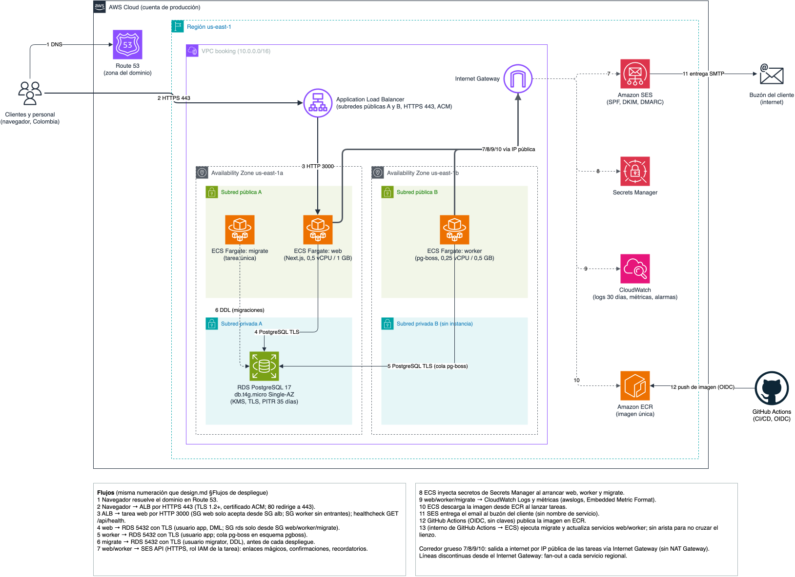

# Design: base de la plataforma de reservas

## Context
- Spec aprobado: `spec.md` (AC-1 a AC-12, requisitos no funcionales, Colombia / Ley 1581, solo mayores de 18).
- Discovery aprobado: `discovery.md` (single-tenant, datos mínimos, sin datos clínicos).
- ADRs de este cambio (todos `Accepted`):
  - [ADR-0001](../../adr/0001-monolito-nextjs-single-tenant-por-capas.md): monolito Next.js con capas `domain`/`server`/`app`/`worker`.
  - [ADR-0002](../../adr/0002-better-auth-enlace-magico-y-segundo-factor-staff.md): Better Auth, enlace mágico, segundo factor obligatorio para personal. Reemplaza a Auth.js de `AGENTS.md`.
  - [ADR-0003](../../adr/0003-postgresql-prisma-single-tenant.md): PostgreSQL 17 + Prisma 7, exclusión de solapamientos en base.
  - [ADR-0004](../../adr/0004-email-ses-y-tareas-con-pg-boss.md): SES tras `EmailSender`, pg-boss en worker.
  - [ADR-0005](../../adr/0005-despliegue-aws-ecs-fargate.md): AWS us-east-1, ECS Fargate, ALB, RDS Single-AZ.
- Artefactos de alcance: `threat-model.md`, `data.md`, `ux.md`, `cost.md`.
- Diagrama de despliegue: `docs/diagrams/00-deployment.drawio` / `.png`.

## Solution overview

| Componente | Responsabilidad | Tecnología |
|---|---|---|
| `src/domain` | Reglas puras: zona horaria y formato de instantes, validación de configuración; en features, disponibilidad, solapamientos, políticas de cancelación | TypeScript sin dependencias de framework |
| `src/server` | Configuración validada (`config.ts`), cliente Prisma, logger, `EmailSender`, cliente de cola, autenticación y guards (`requireUser`, `requireStaff`), casos de uso | Prisma 7 + `@prisma/adapter-pg`, pino, pg-boss, Better Auth, AWS SDK v3 SESv2, Nodemailer (SMTP local) |
| `src/app` | Rutas App Router: inicio, 404, error, `GET /api/health`; en features, cliente `(customer)` y panel `(staff)` | Next.js 16, React, shadcn/ui, Tailwind CSS 4 |
| `src/proxy.ts` | Nonce y headers de seguridad (CSP, HSTS en producción, `X-Content-Type-Options`, `Referrer-Policy`, `frame-ancestors`), `requestId` | Next.js proxy |
| `src/worker` | Proceso de tareas: registro de handlers pg-boss, apagado ordenado | Node.js 24 |
| `prisma/` | Esquema y migraciones | Prisma Migrate |
| `Dockerfile` | Dos imágenes multi-etapa con base endurecida común y usuario no root: `runner` (web por defecto, worker con `node dist/worker.mjs`) y `migrator` (aplica migraciones). El CLI de Prisma queda fuera de `runner` | `node:24-slim` fijado por digest |
| `docker-compose.yml` | Desarrollo local: `db` (postgres:17), `mail` (Mailpit) | Docker Compose |
| `.github/workflows/ci.yml` | Lint, formato, typecheck, unit, integración, e2e, migraciones, build de imagen, escaneos | GitHub Actions |

Flujo de arranque de `web`: `config.ts` valida variables con zod → si falla, sale con código 1 nombrando la variable
(AC-5) → crea cliente Prisma y logger → Next.js sirve. `worker`: mismo `config.ts` → `boss.start()` → registra handlers
(en este cambio ninguno de negocio; solo `system.heartbeat` cada minuto para la métrica de salud de la cola).

Variables de entorno (todas validadas; `.env.example` sin valores):
`DATABASE_URL`, `BETTER_AUTH_SECRET` (≥ 32 bytes), `BETTER_AUTH_URL`, `BUSINESS_NAME`, `BUSINESS_TIMEZONE` (IANA),
`BRAND_PRIMARY_COLOR` (hex, contraste ≥ 4,5:1), `EMAIL_TRANSPORT` (`ses` | `smtp`), `EMAIL_FROM`, `SMTP_URL` (si
`smtp`), `AWS_REGION` (si `ses`), `LOG_LEVEL`, `NODE_ENV`. `MIGRATION_DATABASE_URL` (usuario `migrator`) la usan solo
los comandos de migración y se valida en `prisma.config.ts`, no en el arranque de la app.

Scripts de `package.json` (actualizan `AGENTS.md` en este cambio): `dev`, `build`, `start`, `worker`, `lint`,
`format`, `format:check`, `typecheck`, `test` (Vitest unit), `test:integration` (Vitest + PostgreSQL real),
`test:e2e` (Playwright), `db:migrate` (`prisma migrate deploy`), `db:dev` (`prisma migrate dev`).

## Interfaces and contracts
- `GET /api/health` (interno, usado por healthcheck del ALB y del contenedor; no es contrato público):
  - 200 `{"status":"ok","db":"ok"}` si `SELECT 1` responde en < 300 ms.
  - 503 `{"status":"degraded","db":"unreachable"}` si falla o excede el tiempo; sin detalles de error (AC-3, AC-4).
  - `Cache-Control: no-store`. Sin autenticación; no expone versión ni datos.
- `EmailSender` (interno): `send({ to, subject, html, text, category }): Promise<{ messageId }>`; `category` ∈
  `auth` | `booking` | `reminder` para métricas. Implementaciones `SesEmailSender`, `SmtpEmailSender`, `MemoryEmailSender` (tests).
- `JobQueue` (interno) sobre pg-boss: `enqueue(name, payload: { ids only }, options)`, `cancel(name, singletonKey)`.
- Sin API pública en este cambio: `harness.toml [contracts]` queda vacío. Si una feature expone API a terceros, se
  registra un OpenAPI allí.
- Compatibilidad: al ser single-tenant y sin clientes externos, las rutas internas se versionan con el código.

## Data
Ver `data.md`. En este cambio: migración inicial vacía (tabla `_prisma_migrations`), esquema `pgboss` creado por el
worker, usuarios de base `app` y `migrator`. Instantes en `timestamptz` UTC. Clasificación y retención de las entidades
conceptuales definidas para que las features las hereden. `Booking` = restricted.

## Deployment and infrastructure
- **Local:** `docker compose up -d db mail && pnpm db:dev && pnpm dev` (worker: `pnpm worker`). Mailpit en
  `http://localhost:8025`. Datos de desarrollo solo sintéticos (`pnpm db:seed` en features).
- **CI (GitHub Actions, en cada PR):** `pnpm install --frozen-lockfile` → `lint`, `format:check`, `typecheck` →
  `test` → servicio PostgreSQL 17: `db:migrate` + `test:integration` → `build` → `test:e2e` (Playwright contra
  `pnpm start` con Mailpit) → build de imagen → arranque de contenedor + `curl /api/health` + verificación de usuario no
  root (AC-8) → escaneos (gitleaks SARIF, Semgrep SARIF, Trivy fs SARIF para dependencias, Trivy de imagen, SBOM
  CycloneDX con syft) → `sdlc check --base` y `sdlc evidence check`. Los jobs existentes `sdlc-gates` se mantienen.
- **Producción:** topología de ADR-0005 y diagrama `00-deployment`. La IaC OpenTofu (`network`, `database`,
  `service`, `email`, `observability`, `budget`) se escribe en un registro de cambio propio, no en este: aquí solo se
  publican los artefactos. Portabilidad: la app solo depende de PostgreSQL, SMTP/SES vía interfaz y variables de
  entorno; la IaC es específica de AWS.
- **Artefactos de release:** `scripts/build-release` construye ambas imágenes y las exporta a `dist/` como archivos
  OCI; el workflow `sdlc-release.yml` genera el SBOM CycloneDX del archivo de `runner`, atesta procedencia y SBOM, y
  firma los artefactos con Sigstore sin claves.
- **Entornos:** `local`, `ci`, `staging` (efímero, `cost.md`), `production`. Sin datos de producción fuera de producción.

### Flujos de despliegue
Numeración compartida con `docs/diagrams/00-deployment.drawio` y con `threat-model.md` (fronteras TB1 a TB4).

| N° | Origen → destino | Protocolo y control | Frontera |
|---|---|---|---|
| 1 | Navegador → Route 53 | DNS | - |
| 2 | Navegador → ALB | HTTPS 443, TLS 1.2+, certificado ACM; 80 redirige a 443 | TB1 |
| 3 | ALB → `web` | HTTP 3000; SG `web` solo acepta desde SG `alb`; healthcheck `GET /api/health` | TB1 |
| 4 | `web` → RDS | PostgreSQL 5432 con TLS, usuario `app` (DML); SG `rds` solo desde SG `web`/`worker`/`migrate` | TB2 |
| 5 | `worker` → RDS | PostgreSQL 5432 con TLS, usuario `app`; cola pg-boss en esquema `pgboss` | TB2 |
| 6 | `migrate` → RDS | PostgreSQL 5432 con TLS, usuario `migrator` (DDL), antes de cada despliegue | TB2 |
| 7 | `web`/`worker` → SES | HTTPS, API SESv2 con rol IAM de la tarea, por IP pública e Internet Gateway | TB3 |
| 8 | Secrets Manager → `web`/`worker`/`migrate` | ECS inyecta secretos al arrancar la tarea (rol de ejecución) | - |
| 9 | `web`/`worker`/`migrate` → CloudWatch | Driver `awslogs` y Embedded Metric Format | - |
| 10 | ECR → tareas | ECS descarga la imagen al lanzar tareas | TB5 |
| 11 | SES → buzón del cliente | SMTP; contenido sin nombre de servicio | TB3 |
| 12 | GitHub Actions → ECR | Push de imagen con OIDC, sin claves de larga duración | TB4 |
| 13 | GitHub Actions → ECS (interno, sin arista en el diagrama) | Ejecuta `migrate` y actualiza servicios `web`/`worker` | TB4 |

## Failure modes and resilience
| Failure | Detection | Mitigation |
|---|---|---|
| RDS inaccesible | `/api/health` 503; healthcheck del ALB; alarma `RDS DatabaseConnections = 0` o `ALB 5xx > 1 %` 5 min | ALB deja de enrutar a la tarea; ECS reinicia tareas no sanas; si es falla de RDS, reinicio o PITR (RTO 4 h) |
| Tarea `web` se cae | Healthcheck ALB; `ECS RunningTaskCount < 1` | ECS reemplaza la tarea (< 2 min); escalado a 2 tareas por CPU |
| Worker detenido o atascado | Métrica `queue.heartbeat.age` > 5 min; `queue.oldest_pending.age` > 10 min | ECS reinicia; pg-boss reanuda trabajos (idempotentes por `singletonKey`); recordatorios atrasados se envían si faltan > 1 h para el turno, si no se descartan con métrica |
| SES rechaza o limita envíos | Excepción en `EmailSender`; métricas `email.failed` por categoría; alarmas de rebote/quejas | Reintentos con backoff en worker; enlace mágico muestra error recuperable; runbook de reputación SES |
| Configuración inválida en despliegue | Tarea sale con código 1 (AC-5); despliegue ECS no se estabiliza | Circuit breaker de despliegue ECS con rollback automático a la definición anterior |
| Migración fallida | Tarea `migrate` con código ≠ 0 | El pipeline no despliega `web`/`worker`; migraciones expand/contract compatibles; snapshot previo si toca datos |
| Dependencia vulnerable publicada | Dependabot, SCA en CI | Parche en ≤ 7 días para `high`, ≤ 48 h para `critical` |
| Pérdida de AZ | Alarmas de salud | ALB multi-AZ; tarea `web` se relanza en otra AZ; RDS Single-AZ requiere PITR en otra AZ (RTO 4 h, RPO ≤ 5 min con PITR, ≤ 24 h garantizado) |

## Observability
- **Logs:** JSON (pino) a stdout → CloudWatch Logs, retención 30 días. Campos: `level`, `timestamp` (UTC ISO-8601),
  `requestId`, `route` (sin query string), `status`, `durationMs`, `userRole` (no ID de usuario), `event`. Lista de
  campos permitidos; redacción de `authorization`, `cookie`, `email`, `phone`, `token` (AC-10).
- **Métricas:** ALB (latencia p95, 5xx, conteo de peticiones), ECS (CPU, memoria, tareas), RDS (CPU, conexiones,
  memoria libre, almacenamiento libre), SES (rebote, quejas), métricas de app vía CloudWatch Embedded Metric Format en
  logs (9 métricas personalizadas, costeadas en `cost.md`): `queue.oldest_pending.age`, `queue.heartbeat.age`, `queue.failed`, `email.sent`/`email.failed`
  por categoría.
- **SLOs (piloto):** disponibilidad de `/api/health` y páginas ≥ 99,5 % mensual; p95 < 500 ms; recordatorios enviados
  ≥ 99 % entre 23 h y 25 h antes del turno (se mide desde la feature de recordatorios).
- **Alarmas (6, `cost.md`):** ALB 5xx > 1 % durante 5 min; ALB p95 > 1 s durante 10 min; `ECS RunningTaskCount web < 1`;
  RDS almacenamiento libre < 20 %; `queue.heartbeat.age` > 5 min; SES tasa de rebote > 5 %. Destino: SNS → email del
  responsable.
- **Trazas:** no en el piloto (costo y complejidad); `requestId` correlaciona logs de `web`. Revisar si el p95 lo exige.

### Rutas de prueba
`src/app/e2e/error/page.e2e.tsx` existe solo para probar la pantalla de error. `next.config.ts` añade la extensión
`e2e.tsx` a `pageExtensions` únicamente con `E2E_ROUTES=1` (`pnpm build:e2e`), así que la imagen de producción,
construida con `pnpm build`, no la contiene ni la enruta.

### Estados de carga
Sin `loading.tsx` en la raíz: un límite de Suspense en la raíz emite el shell HTTP antes de renderizar y fuerza 200 en
errores y 404, lo que inutilizaría la alarma de 5xx del ALB. Los estados de carga se añaden por segmento en las
features que los necesiten.

## Rollout and rollback
- **Este cambio:** sin usuarios; se integra a `main` tras review. El primer despliegue a AWS ocurre en la fase release
  con IaC, en staging y luego producción.
- **Despliegue continuo posterior:** imagen inmutable por SHA → `migrate` → ECS rolling update (`minimumHealthyPercent
  100`, `maximumPercent 200`) con circuit breaker y rollback automático.
- **Rollback:** redeploy de la definición de tarea anterior (1 comando, < 10 min). Base: migraciones expand/contract
  compatibles con la versión anterior; rollback de datos solo con snapshot previo y confirmación humana.
- **Feature flags:** no en este cambio; las features nuevas se ocultan detrás de variables de entorno booleanas
  documentadas hasta su release.

## Decisions
| ADR | Title | Status |
|---|---|---|
| [0001](../../adr/0001-monolito-nextjs-single-tenant-por-capas.md) | Construir un monolito Next.js single-tenant con capas de dominio aisladas | Accepted |
| [0002](../../adr/0002-better-auth-enlace-magico-y-segundo-factor-staff.md) | Autenticar con Better Auth: enlace mágico para todos y segundo factor obligatorio para el personal | Accepted |
| [0003](../../adr/0003-postgresql-prisma-single-tenant.md) | Persistir en PostgreSQL con Prisma, una base por instalación y restricciones de integridad en la base | Accepted |
| [0004](../../adr/0004-email-ses-y-tareas-con-pg-boss.md) | Enviar email con Amazon SES tras una interfaz propia y ejecutar tareas programadas con pg-boss en un worker | Accepted |
| [0005](../../adr/0005-despliegue-aws-ecs-fargate.md) | Desplegar en AWS us-east-1 con ECS on Fargate, ALB y RDS PostgreSQL Single-AZ | Accepted |

Decisiones del product owner incorporadas el 2026-09-17:
1. Tope de costo enmendado en `spec.md` a ≤ USD 90/mes; se mantiene la topología de ADR-0005 (≈ USD 77,40/mes).
2. Better Auth reemplaza a Auth.js (ADR-0002); `AGENTS.md` se actualiza en la fase implement.
